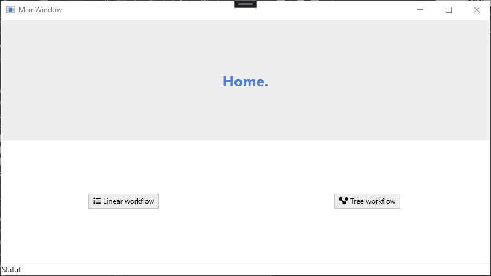

# What is it

This small workflow system can cover most of the needs with work/task/steps in an app :
- Everything can be awaited (including UI depend work)
- Allow to pass context between tasks of a workflow
- Simple linear workflow and a Tree workflow for more complexe uses

It make it easy to extend it with :
- Make it easy if you ever need to play the whole process automatically (without UI). You can easily replace UI work by the normal work class
- Can be extended to have a full UI system based on that (with navigation handling)
- Logging system
- Separation of concern, if you want to have everything perfectly separated you can have UI work call independante backend work

# Linked

Use [Adonis UI](https://benruehl.github.io/adonis-ui/) for the styling.
