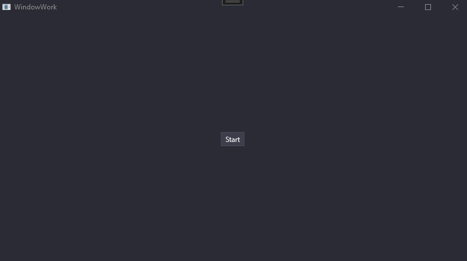

# What is it

This small workflow system can cover most of the needs with work/task/steps in an app :
- Global context between pages
- Pass data between pages with parameters and return value
- Everything can be awaited (including UI depend work)

It make it easy to extend it with :
- Make it easy if you ever need to play the whole process automatically (without UI). You can easily replace UI work by the normal work class
- Can be extended to have a full UI system based on that (with navigation handling)
- Logging system
- Separation of concern, if you want to have everything perfectly separated you can have UI work call independante backend work

# Could be improved

- Template that handle no return values / no parameters (doubt that possible without reflection) ?
- Maybe UI work should be only an wrapping of an existing work (for better separation of concern)
- Use another name than 'work' for the whole thing (too bad Task is already taken)

- Cancel workflow = cancel current task
- Workflow return the state of the task instead of it's own
- Separate navigation from show (to have a container without a window for exemple)

# Linked

The user controls are based on [Adonis UI](https://benruehl.github.io/adonis-ui/) for the styling.
